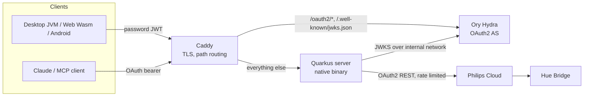

## Goal

Hue Manager is a self-hosted daemon that keeps a Philips Hue home on an all-day lighting
schedule, plus Desktop, Web and Android clients and an MCP endpoint that expose the same
control surface. It exists because Hue's own all-day scenes forget themselves whenever a lamp
is switched off at the wall, and because Hue ships no desktop control at all — so the phone
becomes a hard dependency for turning on a light.

It is built for one person controlling one home from a VDS they own. There are no accounts,
no tenants and no roles: a single password gates the clients, and a single OAuth grant
connects the server to one Philips account.

## The system

The server is the only long-lived component. It holds the Philips OAuth grant, runs the
automation loop, caches all bridge state, serves the web client, and answers both the REST
API and MCP. Clients are thin: they poll, render and issue writes.

### Modules

| Module | Target | Contains |
|---|---|---|
| `server` | JVM → GraalVM native binary | REST API, automation, Hue client, cache, MCP, OAuth glue |
| `shared` | JVM, Wasm, Android | Data models, API DTOs, JSON config |
| `composeApp` | JVM, Wasm, Android library | All UI, view models, API client, platform storage |
| `androidApp` | Android application | Activity wrapper around `composeApp` |

### How the bridge is reached

!control select bridge-access
= Philips Cloud Remote API over OAuth2 — the server needs no route into the home LAN, so it can live on a rented VDS
- Local bridge HTTP on the LAN — no Philips app registration, no token refresh, no HTTPS requirement, but the server must sit inside the home network
- LAN bridge reached over a VPN mesh — keeps local latency and no cloud dependency, at the cost of running a tunnel on the bridge's network

> [!IMPORTANT]
> Philips only issues Remote API grants to an HTTPS redirect URI on a real domain. Localhost
> and bare IPs are rejected, which is why Caddy with automatic Let's Encrypt certificates is
> part of the minimum deployment rather than an optional extra.

### Server runtime

!control select server-runtime
= Quarkus compiled to a GraalVM native image — ~86 MB binary at ~45 MB RSS, which is what makes a small VDS enough alongside Hydra
- Quarkus on the JVM — same code, no multi-minute native compile in CI, at roughly 5x the resident memory
- Ktor on Netty — what this was before; less build-time machinery and no reflection registration to reason about
- Spring Boot — the widest library and documentation surface for anything added later

Native compilation is the source of the sharpest edges in this codebase. Anything resolved
reflectively at runtime has to be visible to the build-time scan, and a `suspend` resource
method's erased signature is not: its return type must be encoded with an explicit
`kotlinx.serialization` serializer or the endpoint returns HTTP 500 only in the native build.

!control select native-builder-image
= Quarkus Mandrel builder image — ships `native-image` with a matching, complete C toolchain, so the Dockerfile installs nothing beyond `libatomic`
- `graalvm-community` base image — the upstream distribution, but its packages conflict with the current appstream repo and need `microdnf` repair
- Host GraalVM plus a hand-assembled toolchain — fastest local iteration, no container layer to rebuild

### State freshness

All reads — REST, MCP, and automation's own sync checks — are served from an in-memory
snapshot refreshed on a fixed interval. Writes patch the snapshot optimistically so a client
sees its own change before the next refresh lands.

!control select state-freshness
= Server-side 5s cache with 500ms/10s client polling — two Philips calls per 5s regardless of how many clients are connected, which keeps the app inside Hue's rate limits
- Server-push over SSE or WebSocket — clients see changes without a poll interval of latency, and idle clients cost nothing
- Pass-through reads with no cache — always current, but N+1 Philips calls per sync poll per client, which is what this replaced
- Hue v2 event stream — the bridge reports changes instead of being asked, removing the poll entirely, if the Remote API exposes it

Philips' limits are enforced on the way out with token buckets: 10 requests per second for
lights, 1 per second for groups. OAuth and bridge-linking calls bypass them as one-time setup.

## Authentication

Two bearer schemes coexist on the same origin and must never be handed each other's tokens.

!control select spa-session-auth
= Password to a jose4j HS256 session JWT — the password crosses the wire once at login, and validation is a local signature check with no session store
- Server-side session cookie — revocable, and nothing sensitive is held in the client
- Password as a bearer on every request — no token lifecycle at all; this is what it replaced
- Hydra OIDC for the clients too — one authorization server for everything, at the cost of a browser redirect on every desktop and Android login

!control select mcp-authorization
= Ory Hydra as authorization server, path-routed by Caddy onto the app's own origin — claude.ai requires the OAuth server to share an origin with `/mcp`, and Hydra supplies Dynamic Client Registration
- Hand-rolled `/mcp/authorize` and `/mcp/token` endpoints — no second container and no Hydra database; this is what was removed
- `quarkus-oidc-proxy` in front of Hydra — fewer moving parts in Caddy, but it cannot serve a `registration_endpoint`
- A static shared bearer token — trivial to operate, and rejected by clients that insist on discovery

The topology only works because of a specific division of labour: Hydra issues tokens, but the
app serves the discovery documents, because Hydra advertises neither an
`oauth-authorization-server` document nor the `registration_endpoint` that DCR needs. The token
issuer is the app's public origin, while the app validates signatures against Hydra's JWKS over
the internal Docker network with discovery disabled, so no public URL is resolved at startup.

> [!WARNING]
> `quarkus.http.auth.proactive=false` is load-bearing. With Quarkus' default proactive auth,
> the OIDC mechanism eagerly validates any `Authorization: Bearer` header — including the SPA's
> HS256 session token on `permit` paths — and rejects it as an invalid Hydra token. The symptom
> is every authenticated write returning 401, which reads as "the session expires instantly".

## Persistence

!control select settings-persistence
= SQLite key/value table over one serialized JDBC connection — survives restarts and redeploys on a named volume, and compiles cleanly to a native image
- PostgreSQL — concurrent writers and real migrations, for a second container and a backup story
- Write settings back into `.env` — nothing to provision, but Philips rotates the refresh token on every refresh and a rewritten env file does not reach a running process
- A JSON file on disk — readable and diffable, with no atomicity across concurrent writes

The split is deliberate: `.env` holds bootstrap secrets that an operator sets (password hash,
JWT secret, Hue client credentials, region, timezone), while the SQLite file holds everything
the user changes at runtime — on/off state, schedule times, per-mode colours, excluded lamps,
the toggle-button sensor, and the rotating Philips access, refresh and username tokens. Lamp
overrides and reachability tracking are ephemeral by design and are not persisted.

## Clients

!control select ui-toolkit
= Compose Multiplatform — one Kotlin UI compiled to Desktop, Wasm and Android, so a lamp card is written once
- Native UI per platform — the best feel on each, at three implementations of every screen
- A web app alone, installed as a PWA — one target and no packaging pipelines, giving up the desktop app that motivated the project

!control multi client-platforms
[x] Desktop JVM — the reason the project exists: control that does not need a phone
[x] Web Wasm — served by the server itself from `web/`, so any browser reaches it with nothing installed
[x] Android — the phone is still the most convenient remote when it is in hand
[ ] iOS — worth adding when the household has an iPhone; the Compose target and shared code are already in place

!control multi client-distribution
[x] macOS DMG via a rolling `nightly` GitHub Release, with a Homebrew Cask on the orphan `brew` branch — `brew install --cask` and `brew upgrade` with no manual step
[x] Linux Flatpak published to an OSTree repo on GitHub Pages — one hosted repo, no distro packaging and no `gh-pages` branch
[x] Android APK attached to the same release and pushed to a Telegram chat — installs on the phone straight from the notification
[x] Web app served by the server — always matches the deployed server, nothing to distribute
[ ] Windows MSI and Debian `.deb` — the jpackage formats are declared in the build already; add CI jobs when there is a machine that needs them

The desktop and Android clients persist only the server URL and the session JWT — Java
Preferences on JVM, `localStorage` on Wasm. The password itself is never stored.

## Build and deployment

The Docker image is one multi-stage build used identically by `docker compose up --build` and
by CI: the Mandrel builder stage compiles the Wasm SPA and the native server, and a
`ubi9-minimal` runtime stage ships the binary plus `web/` as a bare numeric UID with no
`/etc/passwd` entry and no shell. Every container runs with a read-only root filesystem, all
capabilities dropped, `no-new-privileges`, and `/tmp` on a tmpfs; the only writable paths are
the named volumes holding the settings database and Hydra's database.

!control select deployment-shape
= Docker Compose on a single VDS behind Caddy — one `docker compose up -d` brings up the app, Hydra and TLS together
- Kubernetes — rolling deploys and real health orchestration, for an operational surface far larger than one home
- The native binary under systemd — no container runtime at all, at the cost of hand-managing Hydra, TLS and the data directory

!control select image-delivery
= Prebuilt native image from GHCR, tagged by commit SHA — the VDS never runs the multi-minute, ~6 GB native compile
- Build from source on the target host — no registry and no CI dependency, if the host has the headroom
- Publish versioned release tags — reproducible rollbacks, once versions mean something; today `latest` and `sha-<commit>` are all that exist

Deploying a change:

- [ ] Push to `master`; CI builds and pushes the native image to GHCR
- [ ] CI boots that exact image against a throwaway in-memory Hydra and runs the smoke test
- [ ] Pull the new tag on the VDS with `docker-compose.prod.yml` once the workflow concludes successfully

### What is verified

!control select test-strategy
= A CI smoke test against the built native image — it catches the failures that only exist in the native build and in the two-bearer-scheme wiring, which no JVM unit test can see
- `@QuarkusTest` integration tests — much faster feedback per endpoint, and they run against the JVM build, where the interesting bugs do not reproduce
- A broad unit test suite — pins the automation logic in detail, at the cost of mocking Philips Cloud
- Browser end-to-end tests — the only thing that covers the clients, which nothing covers today

The smoke test asserts an exact set of status codes: wrong password 401, correct password 200,
unauthenticated write 401, authenticated write with the session JWT 200, the OAuth discovery
documents 200, and `/mcp` returning a 401 that carries a `resource_metadata` pointer. Each of
those assertions is a regression that has actually shipped. Outside it, only `SunCalculator`
has unit tests.

## Decisions

Automation is opt-out: every lamp the bridge reports is automated unless its id is in
`excludedLampIds`. Adding a lamp to the home should not require adding it to the app.

Manual changes are respected for one hour and then revert to the schedule. The same "clear
override" affordance appears when a lamp is merely detected out of sync with its automation
target — changed by Google Home, Alexa or the official Hue app — so control can always be
handed back without hunting for which app took it.

Lamps in an active Hue Sync entertainment group are surrendered entirely: automation skips
them and the UI hides their colour dot, toggle, brightness and picker rather than disabling
them. Hue Sync is expected to run alongside this, not to be replaced by it.

The daylight model is deliberately coarse — sun down means warm white at full brightness, sun
up means off, with orange evening and dim orange night profiles after a user-set pseudo-sunset.
Sunrise and sunset come from the NOAA Solar Calculator over the configured coordinates, so
there is no external API and no key to manage.

A 10-minute heartbeat re-applies automation state. This is what makes the schedule survive a
lamp being switched off at the wall and back on, which is the failure Hue's own scenes have.

Kotlin compiles against a JDK 17 toolchain while the native build runs on JDK 21. The clients
are bound by Android and jpackage expectations; the server is bound by Mandrel.

## Invariants

The SPA session JWT and Hydra's MCP access tokens must never be validated by each other's
mechanism. OIDC applies to `/mcp` only, and auth stays non-proactive.

The OAuth issuer that clients see is always the app's public origin, never Hydra's internal
address. Hydra is reached internally for JWKS and the admin API, and its ports are never
published.

Every value returned from a `suspend` JAX-RS resource method is encoded with an explicit
`kotlinx.serialization` serializer. So is every exception-mapper body. Reflective serializer
lookup does not survive native compilation.

Read paths make zero Philips Cloud calls. Only the cache refresh loop and explicit writes talk
to the network, and every lights or groups call passes through a rate limiter.

Secrets live in `.env` and never in the SQLite file; runtime settings live in SQLite and are
never written back to `.env`.

The `web/`, `/api`, `/mcp`, `/q` and `/.well-known` prefixes stay reserved from the SPA
catch-all, and the catch-all resolves only within the `web/` directory.

Containers stay runnable with a read-only root filesystem. Anything the server needs to write
goes to `/app/data` or to tmpfs, never next to the binary.

## Out of scope

Multiple users, roles or per-user lamp visibility. One password, one household.

Local-network bridge access, discovery or fallback. The cloud OAuth path is the only path, and
the server is assumed to be somewhere other than the home LAN.

Semantic versions and release notes. Images are tagged by commit and desktop builds are a
rolling nightly; there is no upgrade story to communicate.

Scene management, room grouping and timers beyond the single daylight model. Groups are read
for entertainment detection, not exposed as a control surface.

Any state store shared between server instances. One process owns the automation, the cache
and the heartbeat.
