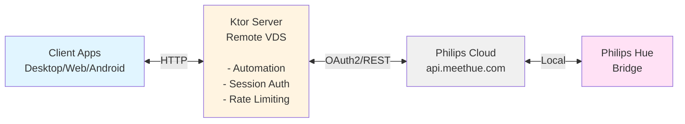

# Hue Manager

A Philips Hue lamp management system with intelligent daylight automation, built with Kotlin Multiplatform. Designed for self-hosting on a remote server using Philips Hue Remote API (OAuth2).

## Features

- Daylight simulation - automatically adjusts lamp brightness and color temperature throughout the day based on sunrise/sunset times
- Wake/sleep modes - one-tap "I woke up!" and "I'm asleep!" actions
- Multi-platform clients - Desktop (JVM), Web (JS/WasmJS), and Android apps
- Entertainment area detection - automatically pauses automation when Hue Sync is active
- Manual override - temporarily disable automation when you manually adjust a lamp

## Architecture



### Bridge Authorization

The server connects to your Hue bridge through Philips Cloud using OAuth2.

As far as I know, Philips Hue OAuth2 requires HTTPS and a valid domain name. You cannot use HTTP-only URLs or IP addresses for the redirect URI in production.

Authorization steps:

1. Register your app at [developers.meethue.com/add-new-hue-remote-api-app](https://developers.meethue.com/add-new-hue-remote-api-app/)
2. Configure OAuth credentials in `.env`:
   - `HUE_CLIENT_ID`, `HUE_CLIENT_SECRET`, `HUE_APP_ID` (from developer portal)
   - `HUE_REDIRECT_URI` - must be HTTPS (e.g., `https://yourdomain.com/api/hue/callback`)
3. Set up HTTPS using Caddy or similar reverse proxy (see Deployment section)
4. Start authorization:
   - Desktop/Android apps: Click "Start Authorizing" - opens your browser automatically
   - Web app: Click "Start Authorizing" - opens authorization page in new tab
   - Manual: Visit `https://yourdomain.com/api/hue/authorize` directly
5. Log in with your Philips Hue account in the browser
6. Press the link button on your bridge when prompted
7. Click "Complete Setup" in the browser - server stores tokens automatically
8. Return to the app (Desktop/Android) and click "Check Again"

## Project Structure

| Module        | Description                                                     |
|---------------|-----------------------------------------------------------------|
| `server/`     | Ktor backend - Hue API integration, automation engine, REST API |
| `composeApp/` | Compose Multiplatform UI (Desktop, Web, Android targets)        |
| `androidApp/` | Android application entry point                                 |
| `shared/`     | Shared data models and API DTOs                                 |

## Quick Start

### 1. Register at Philips Hue Developer Portal

1. Go to [developers.meethue.com/add-new-hue-remote-api-app](https://developers.meethue.com/add-new-hue-remote-api-app/)
2. Create an account and register your application
3. Note your Client ID, Client Secret, and App ID

### 2. Configure Environment

Copy `.env.example` to `.env` and configure:

```bash
PASSWORD=your_secure_password
REGION=52.52,13.405  # latitude,longitude for sunrise/sunset calculation
PSEUDO_SUNSET=21:00  # when evening mode starts
TIMEZONE=Europe/Berlin

# Hue Remote API app details (OAuth2)
HUE_CLIENT_ID=your_client_id
HUE_CLIENT_SECRET=your_client_secret
HUE_APP_ID=your_app_id
HUE_REDIRECT_URI=https://yourdomain.com/api/hue/callback

# OAuth2 tokens (auto-populated after authorization)
HUE_ACCESS_TOKEN=
HUE_REFRESH_TOKEN=
HUE_USERNAME=
```

### 3. Run the Server

Local development:
```bash
./gradlew :server:run
```

Docker:
```bash
docker compose up -d
```

### 4. Authorize Your Bridge

1. Open `http://your-server:8080/api/hue/authorize` in a browser or use the App UI
2. Log in with your Philips Hue account
3. Press the link button on your bridge when prompted
4. Click "Complete Setup"

### 5. Run a Client

Desktop:
```bash
./gradlew :composeApp:run
```

On first launch:
- Enter server URL (e.g., `http://localhost:8080`)
- Login with password from `.env`

Web (Wasm):
```bash
./gradlew :composeApp:wasmJsBrowserDevelopmentRun
```

Android:
```bash
./gradlew :androidApp:assembleDebug
```

## Docker Deployment

There are two deployment methods available:

### Method 1: Local Build (Development/Testing)

Builds from source using the multi-stage `Dockerfile`:

```bash
docker compose up -d --build
```

This is suitable for local development and testing. The template `docker-compose.yml` is configured for local builds.

### Method 2: Production Deployment with HTTPS

For production, use pre-built images from GitHub Container Registry with Caddy for HTTPS.

Copy and configure Caddyfile:
```bash
cp Caddyfile.example Caddyfile
# Edit Caddyfile and replace 'yourdomain.com' with your actual domain
```

Update docker-compose.yml:
```yaml
services:
  hue-manager:
    image: ghcr.io/commandertvis/hue-manager:sha-<commit-hash>
    # ... rest of config

  caddy:
    image: caddy:latest
    restart: unless-stopped
    ports:
      - "80:80"
      - "443:443"
    volumes:
      - ./Caddyfile:/etc/caddy/Caddyfile
      - caddy_data:/data
      - caddy_config:/config
```

Deploy:
```bash
docker compose up -d
```

Caddy will automatically provision Let's Encrypt SSL certificates for your domain.

## API Endpoints

| Method | Endpoint                     | Auth | Description                            |
|--------|------------------------------|------|----------------------------------------|
| GET    | `/api/status`                | No   | Connection status and automation state |
| GET    | `/api/lamps`                 | No   | List all lamps                         |
| GET    | `/api/lamps/{id}`            | No   | Get single lamp state                  |
| PUT    | `/api/lamps/{id}`            | Yes  | Update lamp state                      |
| PUT    | `/api/lamps/all`             | Yes  | Update all lamps                       |
| POST   | `/api/session`               | No   | Login with password                    |
| POST   | `/api/wakeup`                | Yes  | Trigger "I woke up!"                   |
| POST   | `/api/sleep`                 | Yes  | Trigger "I'm asleep!"                  |
| GET    | `/api/automation`            | No   | Automation status                      |
| GET    | `/api/settings`              | No   | Get automation settings                |
| PUT    | `/api/settings`              | Yes  | Update automation settings             |
| DELETE | `/api/lamps/{id}/override`   | Yes  | Clear manual override                  |
| GET    | `/api/hue/authorize`         | No   | Start OAuth2 flow                      |
| GET    | `/api/hue/callback`          | No   | OAuth2 callback                        |
| POST   | `/api/hue/link`              | No   | Complete bridge linking                |
| POST   | `/api/mcp`                   | Yes  | MCP (Model Context Protocol) endpoint  |

## MCP Integration

The server exposes an MCP endpoint for integration with Claude and other MCP-compatible clients.

```json
{
  "mcpServers": {
    "hue-manager": {
      "url": "https://yourdomain.com/api/mcp",
      "headers": {
        "Authorization": "Bearer YOUR_PASSWORD_HERE"
      }
    }
  }
}
```

Replace `yourdomain.com` with your server domain and `YOUR_PASSWORD_HERE` with the same `PASSWORD` from your `.env` file.

### Available MCP Resources

| Resource URI   | Description                                                        |
|----------------|--------------------------------------------------------------------|
| `hue://lamps`  | List all lamps with current state (on/off, brightness, color, automation status) |

### Available MCP Tools

| Tool                   | Description                                                    |
|------------------------|----------------------------------------------------------------|
| `get_lamp_state`       | Get detailed state of a specific lamp including automation/override/Hue Sync status |
| `set_lamp_state`       | Control a lamp (on/off, brightness, hue, saturation, color temperature). Creates 1-hour override |
| `set_all_lamps`        | Control all lamps at once (on/off, brightness). Creates overrides for all lamps |
| `clear_lamp_override`  | Clear manual override for a lamp, returning it to automation control |
| `get_automation_status`| Get current automation mode, user state, target color, and overridden lamps |
| `wake_up`              | Trigger "I woke up!" action - starts daylight automation sequence |
| `go_to_sleep`          | Trigger "I'm asleep!" action - turns off all automated lamps   |

## Daylight Automation

The automation engine simulates natural daylight patterns based on your location and preferences:

| Time Period         | Behavior                                              |
|---------------------|-------------------------------------------------------|
| Wake → Sunset       | Bright white light, compensating for outdoor darkness |
| Pseudo-sunset → +3h | Gradual transition to warm orange (#FF5500), dimming  |
| After wind-down     | Minimal orange light (1% brightness)                  |
| Sleep action        | All automated lamps off                               |

### Smart Features

- Adjusting a lamp manually disables automation for 1 hour
- Automation pauses for lamps in active Hue Sync sessions
- 10-minute polling restores automation if lamps are turned back on

## Tech Stack

- Kotlin/Multiplatform
- Ktor
- Jetpack Compose and Compose Multiplatform
