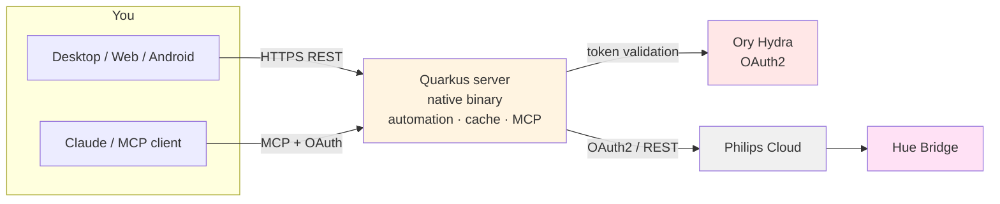

# Hue Manager

Self-hosted daylight automation and control for Philips Hue, with Desktop, Web, and
Android clients. It keeps an all-day lighting schedule running without manual
re-triggering and provides lamp control independent of the phone app.

## Features

- Daylight automation: lamps track the sun for the configured location — warm white when
  it is dark, off when the sun is up, and an orange evening/night profile after a
  configurable pseudo-sunset.
- Automation resumes on its own after a lamp is switched off and back on.
- Manual changes apply for one hour, then revert to the schedule.
- Desktop (JVM), Web (Wasm), and Android clients, kept in sync in real time.
- Lamps in an active Hue Sync entertainment session are left untouched until it ends.
- MCP endpoint for reading and setting lamp state from an AI assistant.
- The server is compiled to a GraalVM native image (~86 MB binary, ~45 MB RAM at idle).

## Architecture



The server reaches the bridge through Philips Cloud over OAuth2; no local network access,
port forwarding, or VPN is required. MCP clients authenticate via OAuth (Ory Hydra); the
web and desktop clients use a password.

## Getting started

```bash
cp .env.example .env   # set password, location, timezone, and Hue OAuth app credentials
docker compose up -d
```

Then open the app and authorize the bridge once (Philips login, then press the bridge
link button). HTTPS via Caddy is required for Hue's OAuth2 — see `Caddyfile.example`.

Desktop (macOS): `brew install --cask commandertvis/hue-manager/hue-manager`

See `.env.example` for configuration and `CLAUDE.md` for the technical reference.
