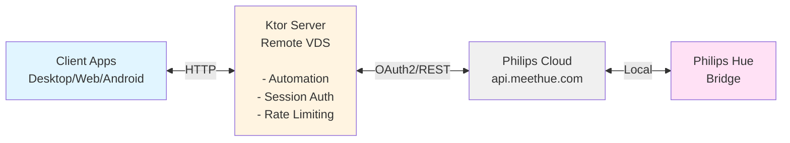

# Hue Manager

A Philips Hue lamp management system with intelligent daylight automation, built with Kotlin Multiplatform. Designed for self-hosting on a remote server using Philips Hue Remote API (OAuth2).

## Features

- **Daylight Simulation**: Automatically adjusts lamp brightness and color temperature throughout the day based on sunrise/sunset times
- **Wake/Sleep Modes**: One-tap "I woke up!" and "I'm asleep!" actions
- **Multi-Platform Clients**: Desktop (JVM), Web (JS/WasmJS), and Android apps
- **Entertainment Area Detection**: Automatically pauses automation when Hue Sync is active
- **Manual Override**: Temporarily disable automation when you manually adjust a lamp

## Architecture



### Bridge Pairing via OAuth2

The server connects to your Hue bridge through Philips Cloud using OAuth2:

1. **Register your app** at [developers.meethue.com](https://developers.meethue.com/)
2. **Configure OAuth credentials** in `.env` (HUE_CLIENT_ID, HUE_CLIENT_SECRET, HUE_APP_ID)
3. **Visit** `/api/hue/authorize` in your browser
4. **Log in** with your Philips Hue account
5. **Press the link button** on your bridge when prompted
6. **Click "Complete Setup"** - server stores tokens automatically

No local network access, port forwarding, or VPN required!

## Project Structure

| Module        | Description                                                     |
|---------------|-----------------------------------------------------------------|
| `server/`     | Ktor backend - Hue API integration, automation engine, REST API |
| `composeApp/` | Compose Multiplatform UI (Desktop, Web, Android targets)        |
| `androidApp/` | Android application entry point                                 |
| `shared/`     | Shared data models and API DTOs                                 |

## Quick Start

### 1. Register at Philips Hue Developer Portal

1. Go to [developers.meethue.com](https://developers.meethue.com/)
2. Create an account and register your application
3. Note your **Client ID**, **Client Secret**, and **App ID**

### 2. Configure Environment

Copy `.env.example` to `.env` and configure:

```bash
PASSWORD=your_secure_password
REGION=52.52,13.405  # latitude,longitude for sunrise/sunset calculation
PSEUDO_SUNSET=21:00  # when evening mode starts
TIMEZONE=Europe/Berlin

# Philips Hue Remote API (OAuth2) - REQUIRED
HUE_CLIENT_ID=your_client_id
HUE_CLIENT_SECRET=your_client_secret
HUE_APP_ID=your_app_id

# OAuth2 tokens (auto-populated after authorization)
HUE_ACCESS_TOKEN=
HUE_REFRESH_TOKEN=
HUE_USERNAME=
```

### 3. Run the Server

**Local development:**
```bash
./gradlew :server:run
```

**Docker:**
```bash
docker compose up -d
```

### 4. Pair Your Bridge

1. Open `http://your-server:8080/api/hue/authorize` in a browser
2. Log in with your Philips Hue account
3. Press the link button on your bridge when prompted
4. Click "Complete Setup"

### 5. Run a Client

**Desktop:**
```bash
./gradlew :composeApp:run
```

On first launch:
- Enter server URL (e.g., `http://localhost:8080`)
- Login with password from `.env`

**Web (Wasm):**
```bash
./gradlew :composeApp:wasmJsBrowserDevelopmentRun
```

**Android:**
```bash
./gradlew :androidApp:assembleDebug
```

## Docker Deployment

```bash
docker compose up -d
```

For production, configure via `docker-compose.yml`:
```yaml
environment:
  PASSWORD: ${PASSWORD}
  REGION: ${REGION}
  PSEUDO_SUNSET: ${PSEUDO_SUNSET}
  TIMEZONE: ${TIMEZONE}
  HUE_CLIENT_ID: ${HUE_CLIENT_ID}
  HUE_CLIENT_SECRET: ${HUE_CLIENT_SECRET}
  HUE_APP_ID: ${HUE_APP_ID}
```

### GitHub Actions CI/CD

Docker images are automatically built and pushed to GitHub Container Registry:
- Tagged with commit hash (e.g., `ghcr.io/you/hue-manager:abc1234`)
- Layer caching enabled for faster builds
- Set container visibility to Private in repository settings

## API Endpoints

| Method | Endpoint                     | Auth | Description                            |
|--------|------------------------------|------|----------------------------------------|
| GET    | `/api/status`                | No   | Connection status and automation state |
| GET    | `/api/lamps`                 | No   | List all lamps                         |
| GET    | `/api/lamps/{id}`            | No   | Get single lamp state                  |
| PUT    | `/api/lamps/{id}`            | Yes  | Update lamp state                      |
| PUT    | `/api/lamps/all`             | Yes  | Update all lamps                       |
| POST   | `/api/session`               | No   | Login with password                    |
| POST   | `/api/wakeup`                | Yes  | Trigger "I woke up!"                   |
| POST   | `/api/sleep`                 | Yes  | Trigger "I'm asleep!"                  |
| GET    | `/api/automation`            | No   | Automation status                      |
| GET    | `/api/settings`              | No   | Get automation settings                |
| PUT    | `/api/settings`              | Yes  | Update automation settings             |
| DELETE | `/api/lamps/{id}/override`   | Yes  | Clear manual override                  |
| GET    | `/api/hue/authorize`         | No   | Start OAuth2 flow                      |
| GET    | `/api/hue/callback`          | No   | OAuth2 callback                        |
| POST   | `/api/hue/link`              | No   | Complete bridge linking                |

## Daylight Automation

The automation engine simulates natural daylight patterns based on your location and preferences:

| Time Period         | Behavior                                              |
|---------------------|-------------------------------------------------------|
| Wake → Sunset       | Bright white light, compensating for outdoor darkness |
| Pseudo-sunset → +3h | Gradual transition to warm orange (#FF5500), dimming  |
| After wind-down     | Minimal orange light (1% brightness)                  |
| Sleep action        | All automated lamps off                               |

### Smart Features

- **Manual Override**: Adjusting a lamp manually disables automation for 1 hour
- **Entertainment Mode**: Automation pauses for lamps in active Hue Sync sessions
- **Heartbeat**: 10-minute polling restores automation if lamps are turned back on

## Tech Stack

- **Kotlin/Multiplatform**
- **Ktor**
- **Compose Multiplatform**
