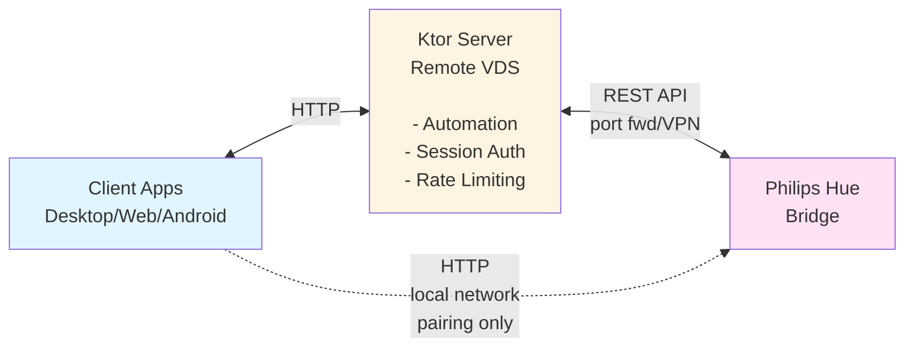

# Hue Manager

A Philips Hue lamp management system with intelligent daylight automation, built with Kotlin Multiplatform. Designed for self-hosting on a remote server while maintaining local bridge pairing capability.

## Features

- **Daylight Simulation**: Automatically adjusts lamp brightness and color temperature throughout the day based on sunrise/sunset times
- **Wake/Sleep Modes**: One-tap "I woke up!" and "I'm asleep!" actions
- **Multi-Platform Clients**: Desktop (JVM), Web (JS/WasmJS), and Android apps
- **Local Bridge Pairing**: Client apps connect directly to Hue bridge on local network for initial setup
- **Bridge Auto-Discovery**: Finds Hue bridges via discovery.meethue.com
- **Entertainment Area Detection**: Automatically pauses automation when Hue Sync is active
- **Manual Override Tracking**: Temporarily disables automation (1 hour) when you manually adjust a lamp

## Architecture



### Bridge Pairing Flow

Since the server runs on a remote VDS and cannot access the local network:

1. **Client discovers bridges** via discovery.meethue.com
2. **Client connects directly** to bridge on local network (192.168.x.x)
3. User presses physical button on bridge
4. **Client creates user credentials** via local HTTP connection
5. **Client sends credentials** (bridgeIp + username) to server
6. **Server uses credentials** to control bridge remotely

## Project Structure

| Module        | Description                                                     |
|---------------|-----------------------------------------------------------------|
| `server/`     | Ktor backend - Hue API integration, automation engine, REST API |
| `composeApp/` | Compose Multiplatform UI (Desktop, Web, Android targets)        |
| `androidApp/` | Android application entry point                                 |
| `shared/`     | Shared data models and API DTOs                                 |

## Quick Start

### 1. Configure Environment

Copy `.env.example` to `.env` and configure:

```bash
PASSWORD=your_secure_password
REGION=52.52,13.405  # latitude,longitude for sunrise/sunset calculation
PSEUDO_SUNSET=21:00  # when evening mode starts
TIMEZONE=Europe/Berlin

# Optional: Hue bridge credentials (auto-populated after pairing)
HUE_BRIDGE_IP=
HUE_USERNAME=
```

### 2. Run the Server

**Local development:**
```bash
./gradlew :server:run
```

**Docker:**
```bash
docker compose up -d
```

### 3. Run a Client

**Desktop:**
```bash
./gradlew :composeApp:run
```

On first launch:
- Enter server URL (e.g., `http://localhost:8080`)
- Login with password from `.env`
- Follow bridge pairing flow (discover → select → press button → pair)

**Web (Wasm):**
```bash
./gradlew :composeApp:wasmJsBrowserDevelopmentRun
```

**Android:**
```bash
./gradlew :androidApp:assembleDebug
```

## Docker Deployment

The server uses host networking for Hue bridge discovery:

```bash
docker compose up -d
```

For production, configure via `docker-compose.yml`:
```yaml
environment:
  PASSWORD: ${PASSWORD}
  REGION: ${REGION}
  PSEUDO_SUNSET: ${PSEUDO_SUNSET}
  TIMEZONE: ${TIMEZONE}
```

### GitHub Actions CI/CD

Docker images are automatically built and pushed to GitHub Container Registry:
- Tagged with commit hash (e.g., `ghcr.io/you/hue-manager:abc1234`)
- Layer caching enabled for faster builds
- Set container visibility to Private in repository settings

## API Endpoints

| Method | Endpoint                     | Auth | Description                            |
|--------|------------------------------|------|----------------------------------------|
| GET    | `/api/status`                | No   | Connection status and automation state |
| GET    | `/api/lamps`                 | No   | List all lamps                         |
| GET    | `/api/lamps/{id}`            | No   | Get single lamp state                  |
| PUT    | `/api/lamps/{id}`            | Yes  | Update lamp state                      |
| PUT    | `/api/lamps/all`             | Yes  | Update all lamps                       |
| POST   | `/api/session`               | No   | Login with password                    |
| POST   | `/api/wakeup`                | Yes  | Trigger "I woke up!"                   |
| POST   | `/api/sleep`                 | Yes  | Trigger "I'm asleep!"                  |
| GET    | `/api/automation`            | No   | Automation status                      |
| GET    | `/api/settings`              | No   | Get automation settings                |
| PUT    | `/api/settings`              | Yes  | Update automation settings             |
| DELETE | `/api/lamps/{id}/override`   | Yes  | Clear manual override                  |
| POST   | `/api/bridge/configure`      | Yes  | Configure bridge with credentials      |

## Daylight Automation

The automation engine simulates natural daylight patterns based on your location and preferences:

| Time Period         | Behavior                                              |
|---------------------|-------------------------------------------------------|
| Wake → Sunset       | Bright white light, compensating for outdoor darkness |
| Pseudo-sunset → +3h | Gradual transition to warm orange (#FF5500), dimming  |
| After wind-down     | Minimal orange light (1% brightness)                  |
| Sleep action        | All automated lamps off                               |

### Smart Features

- **Manual Override**: Adjusting a lamp manually disables automation for 1 hour
- **Entertainment Mode**: Automation pauses for lamps in active Hue Sync sessions
- **Heartbeat**: 10-minute polling restores automation if lamps are turned back on

## Tech Stack

- **Kotlin/Multiplatform**
- **Ktor**
- **Compose Multiplatform**
