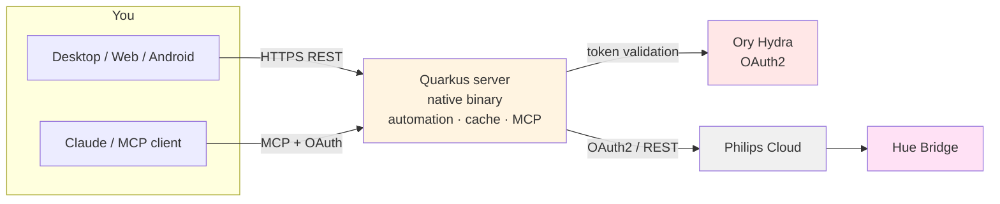

# Hue Manager

Self-hosted control and **daylight automation** for Philips Hue — because the official
app forgets your all-day scene the moment a lamp is switched off, and there's no real
desktop control when your phone isn't around.

## What makes it different

- **Daylight simulation** — lamps follow the real sun for your location: warm white while
  it's dark, off when the sun is up, then orange "evening" and dim "night" after your
  chosen pseudo-sunset.
- **It never forgets.** Turn a lamp off and on and automation simply resumes — no daily
  babysitting from your phone.
- **Manual changes are temporary.** Adjust a lamp by hand and it holds for 1 hour, then
  returns to automation on its own.
- **Control from anywhere** — native Desktop, Web, and Android clients, all in real-time
  sync across every connected device.
- **Stays out of Hue Sync's way** — automation pauses for any lamp in an active
  entertainment session and resumes when it ends.
- **Control it from Claude** — exposes an MCP endpoint, so an AI assistant can read and
  set lamp state directly.
- **Tiny.** The server compiles to a single ~86 MB native binary that idles around 45 MB RAM.

## Architecture



The server talks to your bridge entirely through Philips Cloud over OAuth2 — no local
network access, port forwarding, or VPN. MCP clients authenticate via OAuth (handled by
Ory Hydra); the SPA uses a plain password.

## Getting started

```bash
cp .env.example .env   # set password, location, timezone, and Hue OAuth app credentials
docker compose up -d
```

Then open the app, authorize your bridge once (Philips login + press the bridge link
button), and you're running. HTTPS via Caddy is required for Hue's OAuth2 — see
`Caddyfile.example`.

**Desktop (macOS):** `brew install --cask commandertvis/hue-manager/hue-manager`

See `.env.example` for all configuration and `CLAUDE.md` for the full technical reference.
