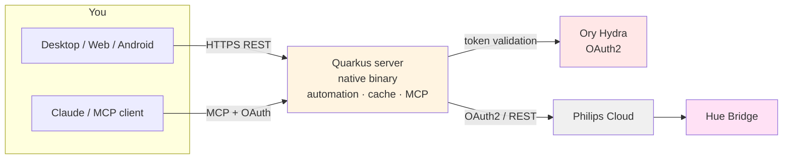

# Hue Manager

Self-hosted daylight automation and control for Philips Hue, with Desktop, Web, and
Android clients. It keeps an all-day lighting schedule running without manual
re-triggering and provides lamp control independent of the phone app.

## Features

- Daylight automation: lamps track the sun for the configured location — warm white when
  it is dark, off when the sun is up, and an orange evening/night profile after a
  configurable pseudo-sunset.
- Automation resumes on its own after a lamp is switched off and back on.
- Manual changes apply for one hour, then revert to the schedule.
- Desktop (macOS: BellSoft NIK native image; Linux: JVM), Web (Wasm), and Android clients, kept in sync in real time.
- Lamps in an active Hue Sync entertainment session are left untouched until it ends.
- MCP endpoint for reading and setting lamp state from an AI assistant.
- The server is compiled to a GraalVM native image (~86 MB binary, ~45 MB RAM at idle).

## Architecture


```mermaid
graph LR
    subgraph You
        UI[Desktop / Web / Android]
        Claude[Claude / MCP client]
    end

    Server[Quarkus server<br/>native binary<br/>automation · cache · MCP]
    Hydra[Ory Hydra<br/>OAuth2]
    Cloud[Philips Cloud]
    Bridge[Hue Bridge]

    UI -->|HTTPS REST| Server
    Claude -->|MCP + OAuth| Server
    Server -->|token validation| Hydra
    Server -->|OAuth2 / REST| Cloud
    Cloud --> Bridge

    style Server fill:#fff4e1
    style Hydra fill:#ffe7e7
    style Cloud fill:#f0f0f0
    style Bridge fill:#ffe1f5
```

The server reaches the bridge through Philips Cloud over OAuth2; no local network access,
port forwarding, or VPN is required. MCP clients authenticate via OAuth (Ory Hydra); the
web and desktop clients use a password.

## Getting started

```bash
cp .env.example .env   # set password, location, timezone, and Hue OAuth app credentials
docker compose up -d
```

Then open the app and authorize the bridge once (Philips login, then press the bridge
link button). HTTPS via Caddy is required for Hue's OAuth2 — see `Caddyfile.example`.

Desktop (macOS): `brew install --cask commandertvis/hue-manager/hue-manager`

Desktop (Linux): `flatpak install --user https://commandertvis.github.io/hue-manager/hue-manager.flatpakref`

See `.env.example` for configuration and `CLAUDE.md` for the technical reference.

## Building the desktop app

macOS release builds use BellSoft Liberica NIK Full, pinned by `desktop.*` in `gradle.properties`.
Gradle downloads the toolchain through Foojay; no separate NIK installation is needed.
macOS statically links AWT and ships a small JAWT bridge for Skiko. Linux continues
to use JVM packaging (`:composeApp:createDistributable`) and Flatpak.
JVM development and Compose Hot Reload remain available through `:composeApp:run`.

```bash
./gradlew :composeApp:nativeRun --no-configuration-cache
./gradlew :composeApp:nativeDmg --no-configuration-cache
```

macOS requires Xcode command line tools. Build on the target architecture.
Native tasks currently opt out of Gradle's configuration cache.

The distributable is under `composeApp/build/native/dist/`, and the DMG is
`composeApp/build/native/dmg/hue-manager.dmg`. The DMG contains an ad-hoc-signed
`Hue Manager.app`; Developer ID signing and notarization are not configured.

`nativeCheck` tests reflective serializer discovery for every shared API model and
JSON decoding/encoding in the native executable. `nativeGuiCheck` additionally
opens a Compose window with isolated preferences. DMG packaging requires both checks.
Reflection/JNI metadata in `composeApp/native/metadata` originates from a NIK tracing
agent run; serializer metadata is generated from the shared `@Serializable` models.
When upgrading Compose, Skiko or NIK, exercise text input, clipboard, dialogs and API
calls with the tracing agent again, and review the resulting metadata before release.
Use `./gradlew :composeApp:nativeTrace --no-configuration-cache`; close the app normally
to flush `composeApp/build/native/traced-metadata/`. Merge relevant entries into the
checked-in metadata and rerun both native checks on macOS.
